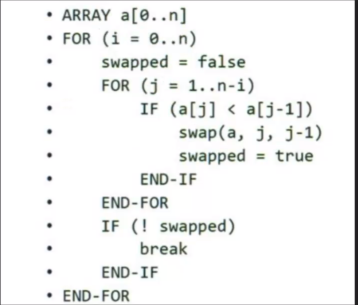
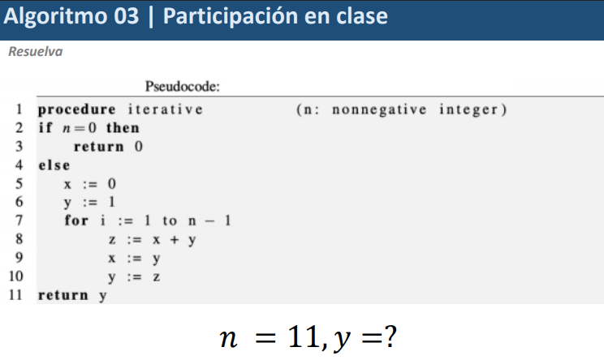

# Markdown
## subtitulo1
## subtitulo 2


* documentacion en github
* Ecuaciones matematicas
    *En notebook de python

# Redacciones de ecuaciones en Markdown
comando para prevaluizar: ctrl + shift + v

´´´ Python
#   programa de Hola mundo
    print("Hola mundo")

# redaccion de ecuaciones 
comando para previsualizar: crtl + shift + v

# Ejemplo


$ x_1 = \frac {-b + \sqrt{b^2-4ac}}{2a}$

# escribir la ecuacion de de navier stokes

$ \pi , \alpha , \beta, \hat{y} , \leftarrow$

$\rho(\frac{\partial\hat{v}})$

# TALLER

## EJERCICIO 1 
La sumatoria $1 + 1/2 +1/4 ...$ tal que el error absoluto $e_{abs} < 10^{-1}$. 

```python
suma = 0
n = 0
while abs(2 - suma) >= 0.1:
    suma += (1/2)**n
    n += 1
print(f"terminos: {n}, Suma: {suma:.6f}, Error: {abs(2-suma):.6f}")
```


## EJERCICIO 2 (Bubble sort)



# Algoritmo 3 



## Graficar 
* El valor de la serie $fib(n)$
* El valor del cociente 
$\phi \rightarrow \frac{fib(n)} {fib(n-1)}$

